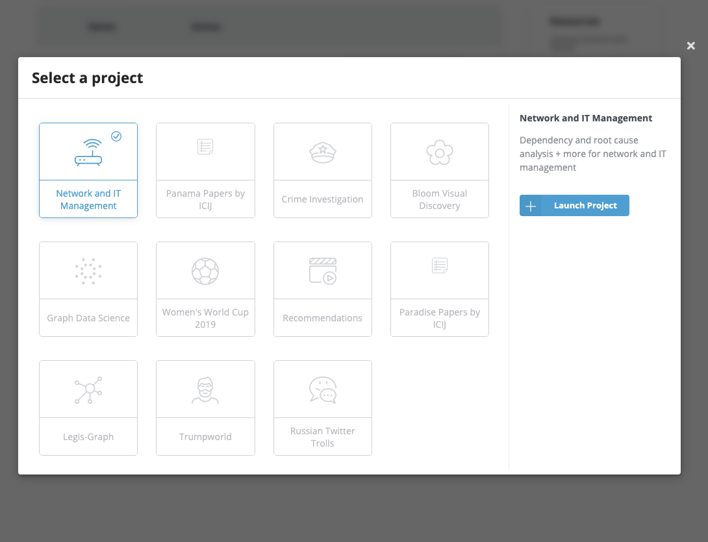
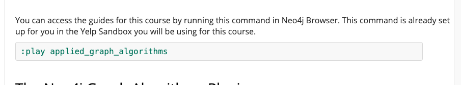
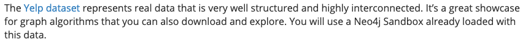

## Welcome to GitHub Pages

Notes for Applied Graph Algorithms

The [Cypher Refresher](https://neo4j.com/graphacademy/online-training/applied-graph-algorithms/part-1/) refers to a Yelp Sandbox. Didn't see that as an option:

This command ran:

with no problem in a Blank Sandbox, maybe the Yelp Sandbox has been discontinued in favor of the script?

Bit of a problem there, the script does not start with a database import. But I found this [Video](https://www.youtube.com/watch?v=7f2Tdn94JhY&feature=youtu.be)

Broken link here:

guessing it might need to lead here: `https://www.yelp.com/dataset`
or here: `https://www.yelp.com/dataset/documentation/main`
